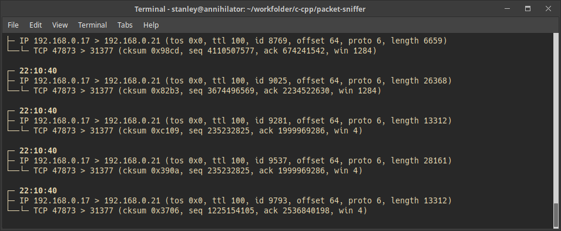

## Packet Sniffer

  

## What is a Packet Sniffer?
A Packet Sniffer is a program that intercepts the network traffic passing through
network interfaces (such as a network board), logging every byte passed through the network.

Packet Sniffers are pretty useful specially for network analyzing and monitoring,
and they are often used by network administrators and security specialists.

The most famous Packet Sniffers on the market are [Wireshark](https://www.wireshark.org/) and
[tcpdump](https://www.tcpdump.org/).

## Can I use it professionally?
I wouldn't recommend this. 😞

This was created for learning purposes, to learn more about network protocols and sockets. It's unstable, won't receive updates, and misses lots of features.

## Can I contribute?
Please, be my guest! 🚀

This is the main purpose of this project: help students to build their own. Or at least to help them understand how they work. I'm also learning, so I'm pretty sure new PRs can still teach me a lot.

I made an effort to keep the code as simple as possible. Still, if you feel the readability could be improved to make it more friendly, feel free to open a PR. Also, if you feel comfortable to implement a fresh new feature here, you are also welcome. 💎

If you need any help to understand this code, you can contact me at stanley.unibh@gmail.com.
